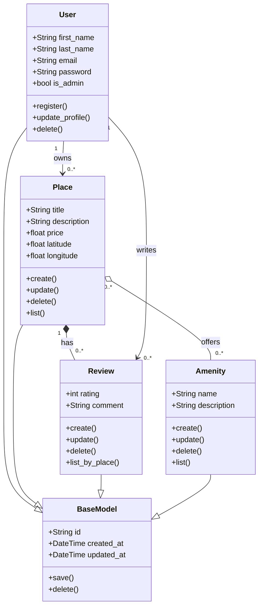

# HBnB Evolution — Business Logic Layer Class Diagram

## Detailed Class Diagram

## Explanatory Notes

### BaseModel
The BaseModel is a shared parent class that holds the attributes needed, a unique `id` (UUID4) and the `created_at` / `updated_at` timestamps required for auditing. This is defined once, since the four domain classes inherit from it.

### User
The User represents the person using the App. This class has important attributes like `first_name`, `last_name`, `email`, `password`, and `is_admin`, which separates regular users from administrators.

### Place
Place represents the properties that are listed by the user, it holds attributes like `title`, `description`, `price`, `latitude`, and `longitude`. 

### Review
Holds the feedback left by a user on a place, it has a `rating` and a `comment`. Each review is linked to one place and is written by an individual user. 

### Amenity
A feature a place can offer, like free wifi, a pool, cable tv. The amenities can be shared across places. 

### Relationships
- **User --> Place** (association, 1 to 0..*): a user can own multiple places, each place has one user as owner.
- **Place --> Review** (composition, 1 to 0..*): a review is attached to a specific place, if the place is deleted, the review is deleted as well. 
- **User --> Review** (association, 1 to 0..*): a user can have many reviews, but the user exists independently of any single review. 
- **Place <--> Amenity** (aggregation, many-to-many): an amenity exists on its own, a place offers many amenities and an amenity can belong to many places 