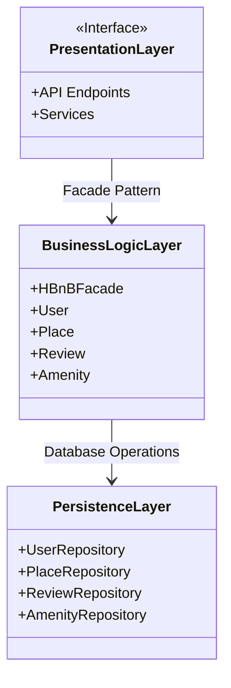

# HBnB Evolution — Technical Documentation

## High-Level Package Diagram

## Explanatory Notes

### Presentation Layer

This layer is the entry point for the application users. The purpose is to expose the API endpoints and services to receive user input and return a response, for example registering a new user or submitting a review. If an input requires more logic, it moves forward through the facade. 

### Business Logic Layer

This is where all the real functions happen and the four domain models exist: User, Place, Review and Amenity. These models enforce tje business rules. This layer also hosts the HBnBFacade, the single entry point it exposes upward to the Presentation Layer.

### Persistence Layer

The purpose of this layer is to store and retrieve data. It contains the repositories that that read and write to the database on behalf of the four domain models.

### The Facade Pattern

The facade pattern provides a single, unified interface to a more complex subsystem. The API does not depend on the internal details of the domain models. As long as the facade interface stays the same, the models can be rearrange.
