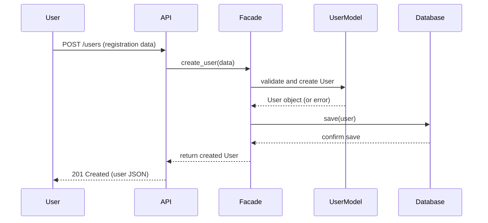
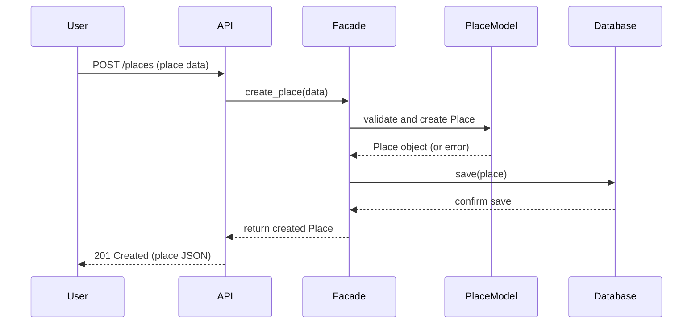
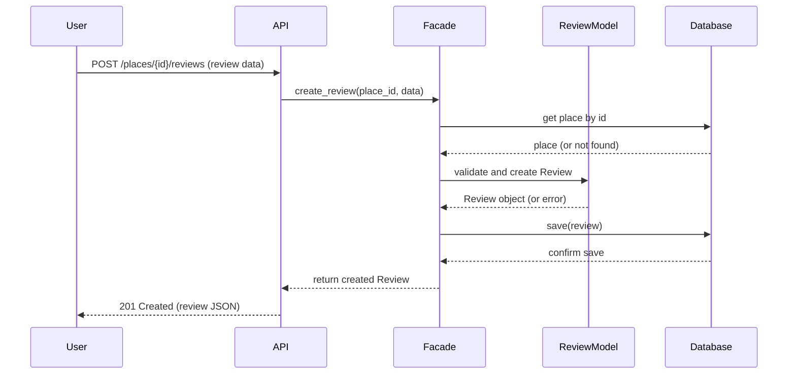
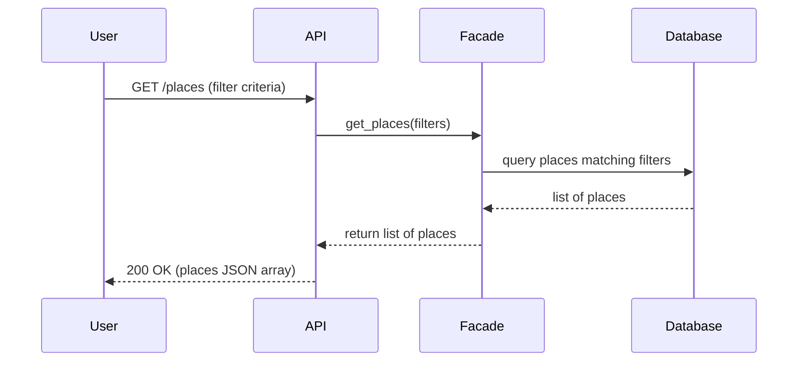

# HBnB Evolution — Sequence Diagrams for API Calls

## 1. User Registration

## 2. Place Creation

## 3. Review Submission

## 4. Fetching a List of Places

## Explanatory Notes

### 1. User Registration
When the account is created the API receives the request to signup and it sends it through the facade using the User model. It validates the data, builds the object and then saves it.

### 2. Place Creation
  This is where the user creates a new property listing, the facade validates and then creates the Place through the model. Linked to its owner from the authenticated user request. 

### 3. Review Submission
When a user leaves a review, the facade first checks the target place actually exists, because a review cannot be written for something that is not there. Once it validates the existence, it creates the Review, saves it and returns it. 

### 4. Fetching a List of Places
A user sends a request for a place, the facade looks into the persistence layer, and brings a collection back. 

### Flow Across All Diagrams
Every diagram follows the same path down through the layers — API to Facade to Model/Database — and back up, with the facade acting as the single coordinator between the presentation layer and the deeper layers.