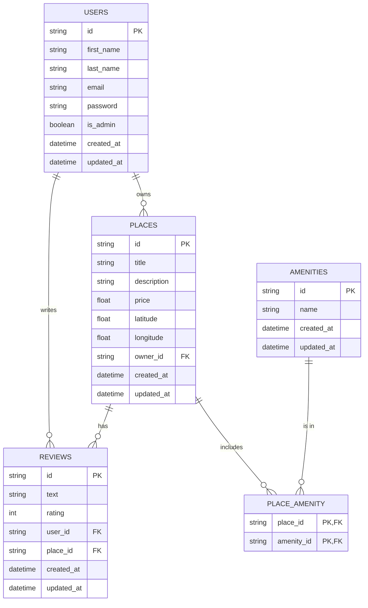

# HBnB - Entity-Relationship Diagram

This diagram represents the database schema for the HBnB project: the five
tables and the relationships between them.

```mermaid
erDiagram
    USERS {
        string id PK
        string first_name
        string last_name
        string email
        string password
        boolean is_admin
        datetime created_at
        datetime updated_at
    }
    PLACES {
        string id PK
        string title
        string description
        float price
        float latitude
        float longitude
        string owner_id FK
        datetime created_at
        datetime updated_at
    }
    REVIEWS {
        string id PK
        string text
        int rating
        string user_id FK
        string place_id FK
        datetime created_at
        datetime updated_at
    }
    AMENITIES {
        string id PK
        string name
        datetime created_at
        datetime updated_at
    }
    PLACE_AMENITY {
        string place_id PK,FK
        string amenity_id PK,FK
    }

    USERS ||--o{ PLACES : owns
    USERS ||--o{ REVIEWS : writes
    PLACES ||--o{ REVIEWS : has
    PLACES ||--o{ PLACE_AMENITY : includes
    AMENITIES ||--o{ PLACE_AMENITY : "is in"
```
